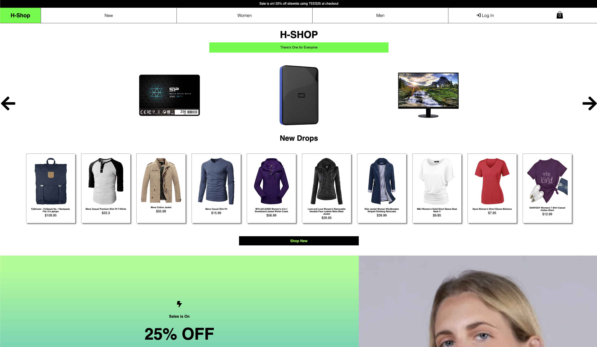

### Friday Laundry e-Commerce frontend

#### Date: 8/02/2022

##### By: Huan Zeng

---

### Links

###### Deployment on Netlify

[website](https://hzecommerce.netlify.app/)

---

### Description

##### Demo e-Commerce website, build under Friday laundry. Launch name as H-Shop in Netlify. Dummy [product](https://fakestoreapi.com/) from https://fakestoreapi.com/. Client can add products to cart, create account for checkout.

### Technologies Used

- React.js
- CSS3
- Node.js (backend)
- PostgreSQL (backend)
- Express (backend)
- Git
- Product API https://fakestoreapi.com/

### Getting Started

#### Page launched in netlify, [click to visit](https://hzecommerce.netlify.app/)

### Credit:

[Product API](https://fakestoreapi.com/) by FakeStoreAPI
